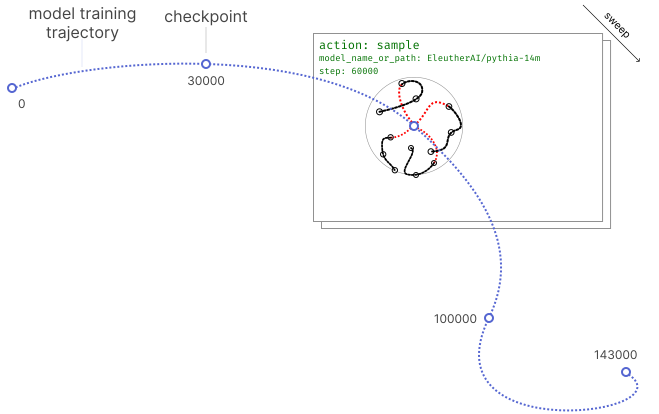
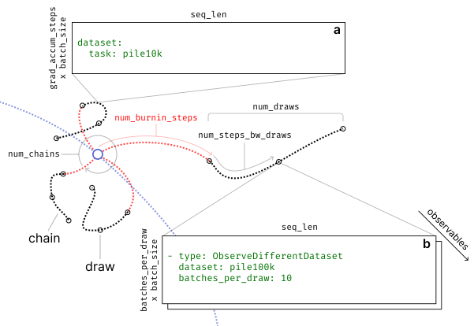
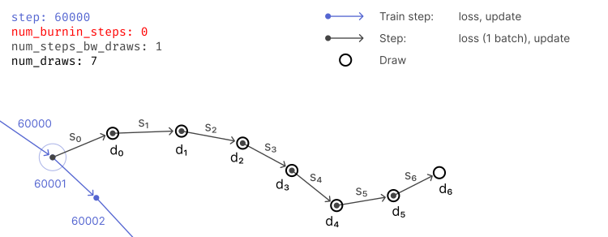
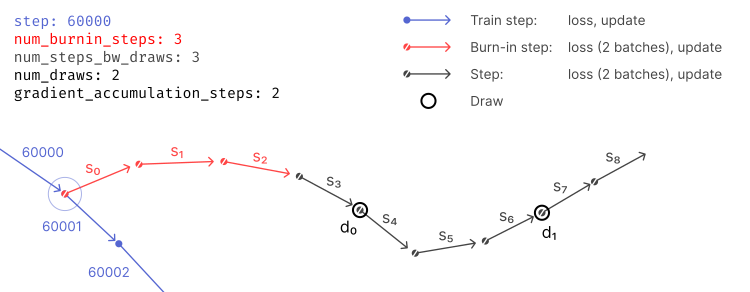

.. _sampling:

Sampling
========

DevInterp uses Stochastic Gradient Langevin Dynamics (SGLD) to sample from the posterior
distribution around model parameters. This is the foundation for computing Local Learning Coefficients (LLCs),
Susceptibilities, and Bayesian Influence Functions (BIFs).

   Sampling runs at a checkpoint along a model training trajectory. Training is separate
   from and precedes sampling.

How Sampling Works
------------------

The ``sample()`` function:

1. Runs multiple independent SGLD chains
2. At each draw, evaluates per-token loss on the sampling dataset and all observables
3. Writes everything to a Zarr store, returned as an ``xr.DataTree``

.. code-block:: python

   from devinterp.slt.sampling import sample

   tree = sample(
       model=model,
       dataset=train_data,            # Used for SGLD gradients
       observables={
           "train": train_data,       # Evaluate loss on training data
           "code": (code_data, 5),    # (dataset, batches_per_draw)
       },
       lr=0.001,
       n_beta=30,
       num_chains=4,
       num_draws=200,
       batch_size=32,
   )

Chains, Steps, and Draws
-------------------------

   Each chain is an independent SGLD trajectory, initialized from the training checkpoint.
   Chains evolve through mini-batch gradients and injected Gaussian noise to explore the
   local loss landscape.

Within each chain:

- **Steps** are individual SGLD updates that move through parameter space. Each step uses
  ``gradient_accumulation_steps * batch_size * seq_len`` tokens per chain.
- **Burn-in steps** (``num_burnin_steps``) are taken before the first draw to let the
  chain reach equilibrium.
- **Draws** occur every ``num_steps_bw_draws`` steps, where we compute observables.

The total number of SGLD steps per chain is:
``num_burnin_steps + num_draws * num_steps_bw_draws``.

For example, with ``num_burnin_steps=0`` and ``num_steps_bw_draws=1``:

   With one step between draws, observables are evaluated after every step.

With ``num_burnin_steps=3`` and ``num_steps_bw_draws=3``:

   With three steps between draws, observables are evaluated after every third step.
   Burn-in steps delay the first draw.

Key Parameters
--------------

**Sampling parameters:**

- ``lr``: SGLD learning rate. Controls step size.
- ``n_beta``: Inverse temperature. Higher values stay closer to the MAP estimate.
- ``num_chains``: Number of independent chains. More chains give better statistics.
- ``num_draws``: Number of draws per chain. More draws give more samples.
- ``num_burnin_steps``: Steps before first draw. Allows the chain to reach equilibrium.
- ``num_steps_bw_draws``: Steps between draws. Reduces autocorrelation between samples.
- ``batch_size``: Batch size for SGLD gradient computation.

**Observable parameters:**

- ``observables``: Dict mapping names to datasets (or ``(dataset, batches_per_draw)``
  tuples). Each observable is evaluated at every draw.
- ``batches_per_draw``: Default number of batches per observable evaluation (default: 3).

**Optimizer hyperparameters:**

- ``sampling_method``: Which SGLD variant to use. ``"sgmcmc_sgld"`` (default) is
  plain SGLD with a localization term; ``"rmsprop_sgld"`` adds RMSprop-style
  preconditioning.
- ``sampling_method_kwargs``: Extra kwargs forwarded to the chosen method
  (e.g. rmsprop's ``alpha`` / ``eps`` / ``add_grad_correction``).
- ``rmsprop_eps`` / ``rmsprop_alpha``: Convenience aliases for the two most
  common rmsprop knobs; only valid when ``sampling_method='rmsprop_sgld'``.
  Equivalent to ``sampling_method_kwargs={"eps": ..., "alpha": ...}``.
- ``localization``: Strength :math:`\gamma` of the pull toward initial parameters
  (Lau et al. 2023). ``0`` disables.
- ``noise_level``: SGLD noise std :math:`\sigma`. Default ``1.0``; changing
  this breaks the posterior-sampling guarantee.
- ``llc_weight_decay``: L2 regularization :math:`\lambda`, applied as a Gaussian
  prior centered at zero.
- ``bounding_box_size``: If set, restricts sampling to a box of this radius
  around the initial parameters. ``None`` disables.
- ``init_noise``: If set, add Gaussian noise with this std to parameters once
  before sampling starts.

**Weight restrictions:**

- ``param_masks``: Dict mapping parameter names to mask tensors (or ``None`` for
  unrestricted). Only parameters in the dict are optimized; all others are frozen.

Output Format
-------------

``sample()`` returns an ``xr.DataTree`` backed by Zarr containing:

- ``init_loss`` *(chain, token_pos)*: Initial loss before sampling
- ``sampling_loss`` *(chain, draw, batch, token_pos)*: Per-token loss at each draw
- ``loss_{obs}`` *(chain, draw, batch_{obs}, token_pos)*: Per-token observable losses
- ``input_ids_{obs}`` *(batch_{obs}, token)*: Fixed input IDs for each observable
- ``n_beta``: Scalar inverse temperature
- ``metrics_*`` *(chain, step)*: SGLD diagnostics (when ``save_metrics=True``)

This DataTree is the input to post-processing functions like ``compute_llc()``,
``compute_bif()``, and ``compute_susceptibilities()``.
